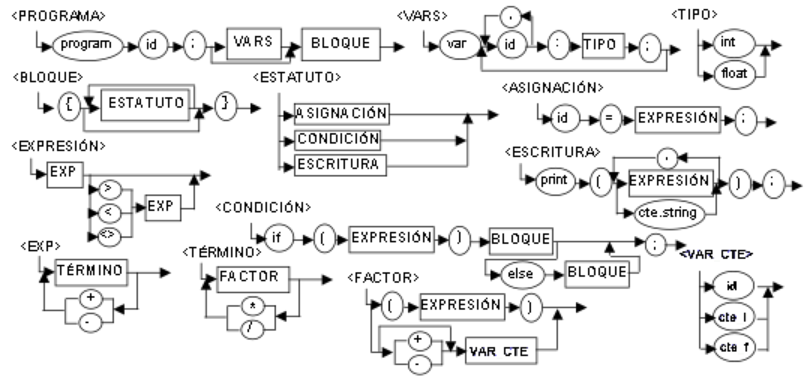

# Tarea 3.1
A continuación se describe un pequeño lenguaje de programación. Se te pide que implementes 2 versiones de los analizadores de léxico y sintaxis (scanner y parser) necesarios para reconocerlo. Debes utilizar la herramienta que planeas usar para tu proyecto. El programa a ejecutar leerá los elementos de un archivo fuente (texto), revisará el léxico y la sintaxis y, en caso de existir error, desplegará en pantalla el mensaje “apropiado”.

##### LENGUAJE: LittleDuck 2020

A continuación se describen las reglas sintácticas del lenguaje LittleDuck 2020. Considerando los tokens que se usan dentro de estas reglas, diseña las reglas de los elementos de léxico (tokens) que sean necesarias (a tu criterio). Considera que esta tarea te dará la pauta para desarrollar las etapas de léxico y sintaxis de tu proyecto.

*Entregar las expresiones regulares y la gramática en un documento.*

## LittleDuck 2020

----------------------------------------------------------------

## Expresiones regulares

|         Token          |     Expresion     |
|------------------------|:-----------------:|
| inicio de programa     | program           |
| letras                 | [a-z], [A-Z]      |
| numero                 | [0-9]             |
| id                     | letra* numero*    |
| var                    | letra* numero*    |
| parentsis izquierdo    | (                 |
| parentsis derecho      | )                 |
| llave curva izquierda  | {                 |
| llave curva derecha    | }                 |
| igual a                | =                 |
| mayor a                | >                 |
| menor a                | <                 |
| diferente a            | <>                |
| suma                   | +                 |
| resta                  | -                 |
| multiplicacion         | *                 |
| division               | /                 |
| print                  | print             |
| condicional if         | if                |
| condicional else       | else              |
| cte string             | "letra*"          |
| cte entera             | numero*           |
| cte flotante           | numero* .numero*  |

## Gramatica

#### PROGRAMA
    PROGRAMA    ->      program id ; BLOCK_VAR | ε
    BLOCK_VAR   ->      VARS | BLOQUE 

#### VARS
    VARS        ->      var FOR_ID
    FOR_ID      ->      id COMA | id COLON
    COMA        ->      , FOR_ID
    COLON       ->      : TIPO ; VAR_END
    VAR_END     ->      FOR_ID | BLOQUE

#### BLOQUE
    BLOQUE      ->      { INFO
    INFO        ->      } | ESTATUTO INFO

### TIPO
    TIPO        ->      INT | FLOAT

#### ESTATUTO
    Estatuto    ->      Asignacion | Condicion | Estritura

#### ASIGNACION
    Asignacion  ->      id = EXPRESION ;

#### CONDICION
    CONDICION   ->      if ( EXPRESION ) BLOQUE COND_ELSE
    COND_ELSE   ->      ; | else BLOQUE ;

#### ESCRITURA
    ESCRITURA   ->      print ( EXP_STR ) ;
    EXP_STR     ->      EXPRESION | cte.string

#### EXPRESION
    EXPRESION   ->      EXP SEMICOL_OP
    SEMICOL_OP  ->      ε | FOR_COMP
    FOR_COMP    ->      COMPARADOR EXP
    COMPARADOR  ->      > | < | <> 

#### EXP
    EXP         ->      TERMINO SUM_SUB
    SUM_SUB     ->      + | -

#### TERMINO
    TERMINO     ->      FACTOR MULT_DIV
    MULT_DIV    ->      * | /

#### FACTOR
    FACTOR      ->      FOR_EXPR | FOR_OP | VARCTE
    FOR_EXPR    ->      ( EXPRESION )
    FOR_OP      ->      + VARCTE | - VARCTE 

#### VARCTE
    VARCTE      ->      id | cte_i | cte_f
